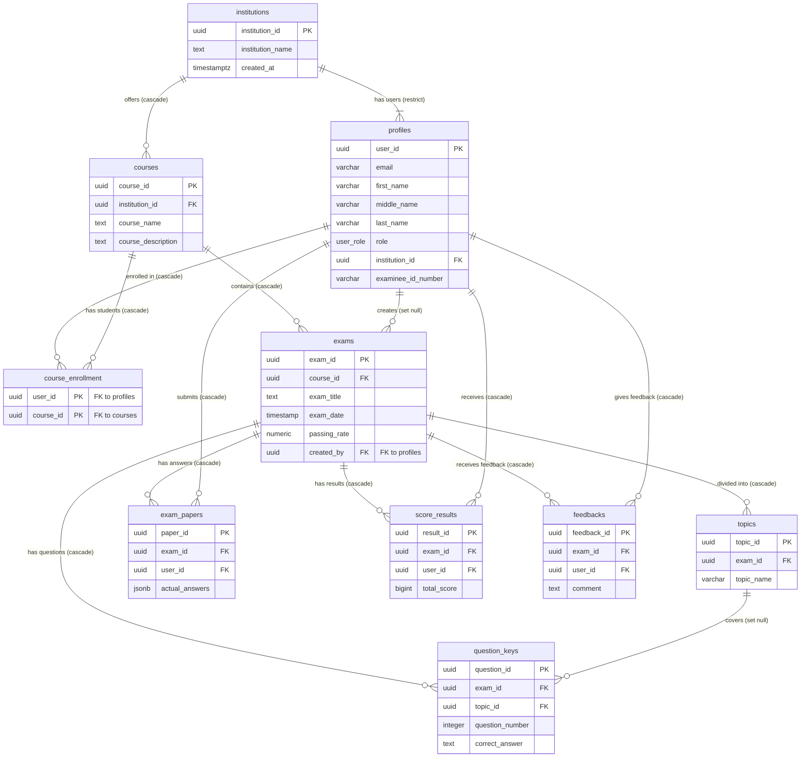

# Supabase Schema Visualizer

This diagram represents the relational database schema defined in the `src/lib/supabase/schema` directory. It maps out the entities, their attributes, and the relationships (Foreign Keys) between them.

